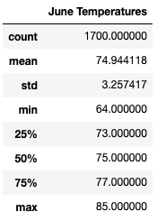
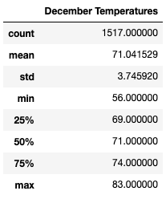
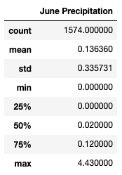
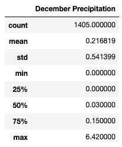

# Surfs Up Analysis

## Overview of Project
The following project will look to an analysis of weather data of Oahu, Hawaii, in order to determine trends to contribute to an investment decision for opening a Surf n’ Shake shop.

### Purpose
The analysis will inform a potential investor of the Surf n’ Shake shop, W. Avy, whether the weather conditions in Oahu, Hawaii will uphold a sound investment decision. Previous investments in a similar business were spoiled by an excess of rainy weather, an impediment on great surf conditions. The project will make use of weather data stored in a SQLite database (hawaii.sqlite) in addition to other Python dependencies and Jupyter Notebook. 

## Results
In order to determine if the Surf n’ Shake shop will have sustainable business all year-round, summary statistics were examined for the months of June (summer) and December (winter) in Oahu, Hawaii. Below are the summary statistics for the temperatures in the months of June and December, filtered from the hawaii.sqlite database.

**June Temperatures/ December Temperatures**

 

* The average temperature in June was 74.9°F (23.8°C) and the average temperature in December was 71.0°F (21.7°C). There is a 3.9-degree difference between the average temperatures in both months.
* The maximum temperature in June was 85.0°F (29.4°C) and the maximum temperature in December was 83.0°F (28.3°C). The difference between maximum temperatures is not as varied as the average temperatures.
* The range in temperatures for June was 64.0°F – 85.0°F (21-degree difference). The range in temperatures for December was 56.0°F – 83.0°F (27-degree difference).

## Summary
Based on the results of the descriptive analyses, it can be said that the average temperatures in June are higher than those in December by 3.9 degrees. The range of temperatures is greater in December (27-degree difference), making conditions more varied. Despite this, even at the lowest point, the temperatures in December are warm enough to provide decent surf conditions. These temperature conditions support a sustainable all-year-round surf shop which serves ice cream to customers.

Due to the previous issues in investments made, it would be prudent to examine the precipitation levels for the months of June and December in conjunction with the temperatures. High temperatures do not preclude rainy weather, which would not be ideal for surfing. Two additional queries were made for the precipitation scores in June and December, as shown below:

**June Precipitation/ December Precipitation**

 

As can be seen, the maximum precipitation score was 4.43 in June and 6.42 in December. Without knowing what is characterized as a “high” precipitation score, it would not be sensible to say whether these levels of precipitation would be detrimental to the Surf n’ Shake shop. Despite this, it can be assumed that these are low scores for precipitation. As per the initial analysis conducted on the weather conditions in Oahu, Hawaii, the maximum precipitation score was 6.70, making the December precipitation score lower.

This data, combined with the temperature analyses, it can be concluded that the weather conditions would not be an issue to the beginnings of the Surf n’ Shake shop business.